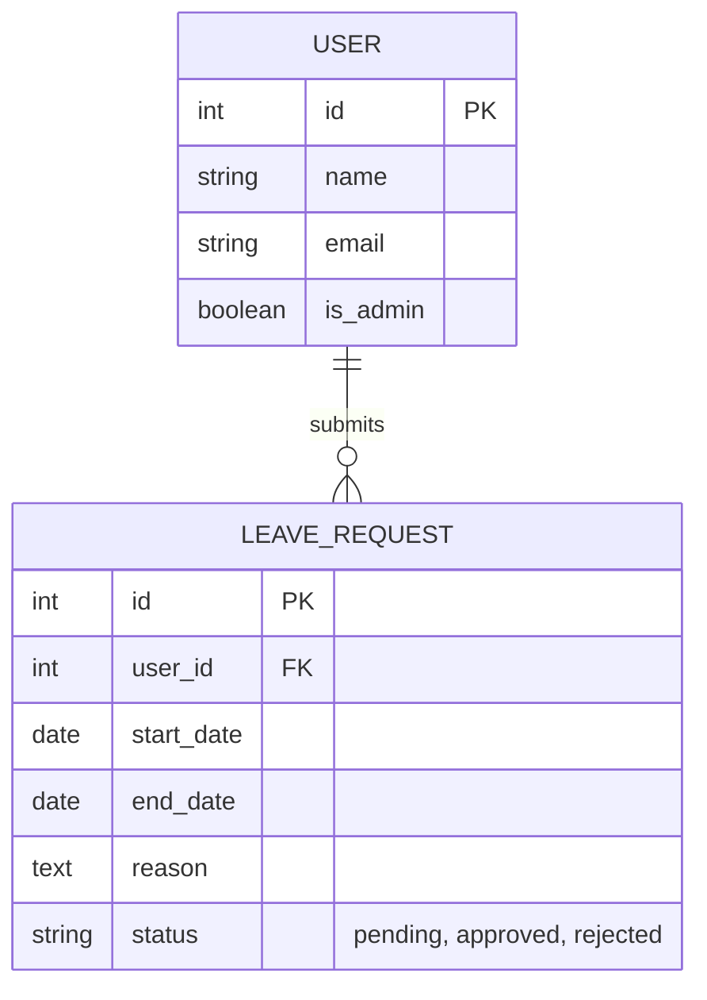
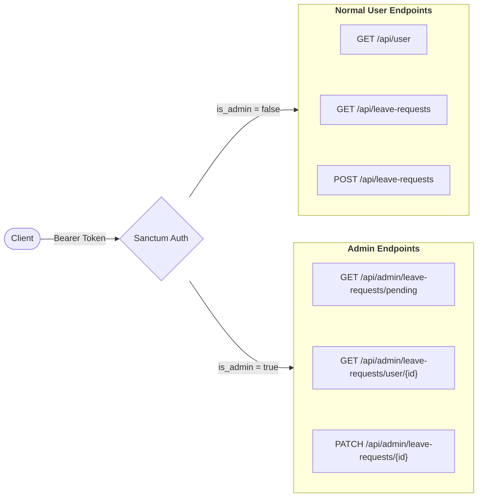

# Leave Management API

A RESTful API for managing employee leave requests, built with **Laravel 13**,
**SQLite**, and **Laravel Sanctum** for token-based authentication.

## Tech Stack

- **PHP** 8.4
- **Laravel** 13.5
- **SQLite** (file-based, zero-config database)
- **Laravel Sanctum** (API token authentication)

### Database Schema



### API Flow & Role Access



## Setup Instructions

```bash
# 1. Clone the repository
git clone https://github.com/carsonak/leave-management-system.git
cd leave-management-system

# 2. Copy the environment file
cp .env.example .env

# 3. Install PHP dependencies
composer install

# 4. Generate the application key
php artisan key:generate

# 5. Run migrations and seed the database. Take note of the keys generated.
php artisan migrate --seed

# 6. Start the development server
php artisan serve
```

## Authentication

The database seeder automatically creates two users and outputs their
**plain-text Sanctum Bearer tokens** directly to the terminal when you
run `php artisan migrate --seed`:

| User | Email | Role |
| --- | --- | --- |
| Admin User | `admin@example.com` | Admin |
| Normal User | `user@example.com` | User |

Copy the tokens from the terminal output and use them in the `Authorization: Bearer <token>` header for all API requests.

> **Tip:** If you need to re-generate tokens, run:
>
> ```sh
> php artisan migrate:fresh --seed
> ```

## API Endpoints

All endpoints require the `Authorization: Bearer <token>` header.

### Health Check

| Method | Endpoint | Description       |
|--------|----------|-------------------|
| GET    | `/`      | API health status |

### Normal User Endpoints

| Method | Endpoint              | Description                                  |
|--------|-----------------------|----------------------------------------------|
| GET    | `/api/user`           | Get the authenticated user's profile         |
| GET    | `/api/leave-requests` | List the authenticated user's leave requests |
| POST   | `/api/leave-requests` | Create a new leave request                   |

### Admin Endpoints

| Method | Endpoint                              | Description                              |
|--------|---------------------------------------|------------------------------------------|
| GET    | `/api/admin/leave-requests/pending`   | List all pending leave requests          |
| GET    | `/api/admin/leave-requests/user/{id}` | List all leave requests for a given user |
| PATCH  | `/api/admin/leave-requests/{id}`      | Approve or reject a leave request        |

## Testing with `curl`

Replace `<USER_TOKEN>` with the normal user token printed by the seeder and
`<ADMIN_TOKEN>` with the admin token.
`jq` is only used to prettify the JSON output.

### 1. Normal User — List My Leave Requests

```bash
curl -s http://localhost:8000/api/leave-requests \
  -H "Authorization: Bearer <USER_TOKEN>" \
  -H "Accept: application/json" | jq
```

### 2. Normal User — Create a Leave Request

```bash
curl -s -X POST http://localhost:8000/api/leave-requests \
  -H "Authorization: Bearer <USER_TOKEN>" \
  -H "Accept: application/json" \
  -H "Content-Type: application/json" \
  -d '{
    "start_date": "2026-05-01",
    "end_date": "2026-05-03",
    "reason": "Family vacation"
  }' | jq
```

### 3. Admin — View All Pending Leave Requests

```bash
curl -s http://localhost:8000/api/admin/leave-requests/pending \
  -H "Authorization: Bearer <ADMIN_TOKEN>" \
  -H "Accept: application/json" | jq
```

### 4. Admin — Approve a Leave Request

```bash
curl -s -X PATCH http://localhost:8000/api/admin/leave-requests/1 \
  -H "Authorization: Bearer <ADMIN_TOKEN>" \
  -H "Accept: application/json" \
  -H "Content-Type: application/json" \
  -d '{
    "status": "approved"
  }' | jq
```

## Validation Rules

### POST `/api/leave-requests`

| Field        | Rules                                |
|--------------|--------------------------------------|
| `start_date` | required, date, after_or_equal:today |
| `end_date`   | required, date, after:start_date     |
| `reason`     | required, string                     |

### PATCH `/api/admin/leave-requests/{id}`

| Field    | Rules                          |
|----------|--------------------------------|
| `status` | required, in:approved,rejected |
